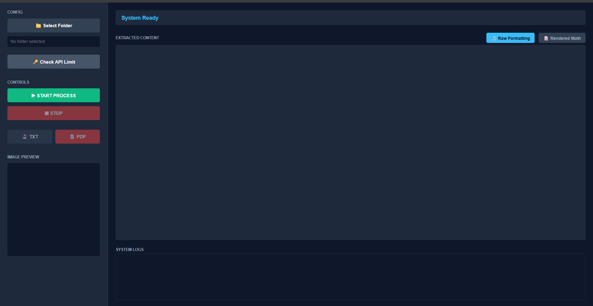

# 🚀 PicToPdf | Physics MCQ Processor
<div align="center">
  
  <br>
  <i>A fully automated, purely client-side Math OCR & PDF rendering machine.</i>
</div>
PictoPdf is a powerful, fully client-side web application designed to automatically convert folders of Physics Multiple Choice Question (MCQ) images into properly formatted AsciiMath text and beautifully rendered printable PDFs. 

Built entirely with HTML, CSS, and Vanilla JavaScript, it requires **zero backend servers** and runs directly in your browser. It utilizes the powerful **Google Gemini API** (`gemini-3-flash-preview`) to accurately detect mathematical notations, equations, and diagrams from images.

## ✨ Features

- **Bulk Image Processing**: Select an entire folder of images at once. The app will sequence through them automatically.
- **Testmoz Compatible AsciiMath**: Extracts math natively into AsciiMath syntax, enabling seamless copy-pasting into quiz platforms like Testmoz.
- **Dual Display Modes**: 
  - 💻 `Raw Formatting`: See the exact text output without mathematical backticks (ready for copy-pasting).
  - 📝 `Rendered Math`: Powered by [MathJax](https://www.mathjax.org/), instantly view beautifully typeset fractions, roots, matrices, and symbols directly on your screen.
- **Smart API Key Rotation & Retry Logic**: Automatically cycles through an array of Gemini API keys built into the application to bypass "Quota Exceeded (429)" constraints. It natively pauses and retries when Google servers throw "High Demand (503)" errors!
- **Data Filtering & Formatting**: Contains a custom-built processing pipeline that automatically cleans up dirty text, guarantees clean spacing, and converts localized tokens (e.g. converting Bengali "বা," to mathematical implication `=>`).
- **Export Formats**:
  - `[💾 TXT]`: Click to download a raw standard text file stripped of AsciiMath triggers.
  - `[📄 PDF]`: Leveraging [html2pdf.js](https://ekoopmans.github.io/html2pdf.js/), it prints your MathJax rendered equations onto a clean, high-contrast, perfectly-sized A4 PDF directly from the browser!
- **Fully Responsive**: Professionally styled with a 'Deep Slate Blue' dark theme that stacks and scales perfectly on all mobile, tablet, and desktop devices.

## 🛠️ Installation & Usage

Because VisionOCR is purely client-side, setup takes zero configuration!

1. Clone or download this repository.
   ```bash
   git clone https://github.com/wahidfarhan/pictopdf.git
   ```
2. Open `index.html` directly in any modern web browser (Google Chrome, Firefox, Safari).
3. OR upload the `index.html`, `app.js`, and `style.css` files to your cPanel / web hosting provider.

### **How to Use:**
1. Click **📁 Select Folder** on the config sidebar and choose a directory containing your `.jpg` or `.png` images.
2. Ensure your Gemini API status is active by clicking **🔑 Check API Limit**.
3. Click **▶ START PROCESS**.
4. The system will loop through every image, send it to the Gemini REST API, typeset the math, and print it onto the main screen. Keep an eye on the `SYSTEM LOGS` box for live updates.
5. Once complete, click **💾 TXT** or **📄 PDF** to download your finalized Physics MCQs!

## 🔧 Technologies Used

- **Frontend Core:** HTML5, CSS3, Vanilla ES6 JavaScript
- **AI Integration:** Google Generative AI REST API (`v1beta`)
- **Math Engine:** MathJax (v2.7.4) - `AM_CHTML` configuration
- **Document Generation:** html2pdf.js (v0.10.1)

## 🔒 Security Note
**Important:** This is a client-side architecture. Your `API_KEYS` array inside `app.js` is exposed to anyone who inspects the website source code. If you are deploying this to the public internet, it is strongly recommended to proxy your Gemini API requests through a secure backend (like Node.js or PHP) or encrypt your keys.
